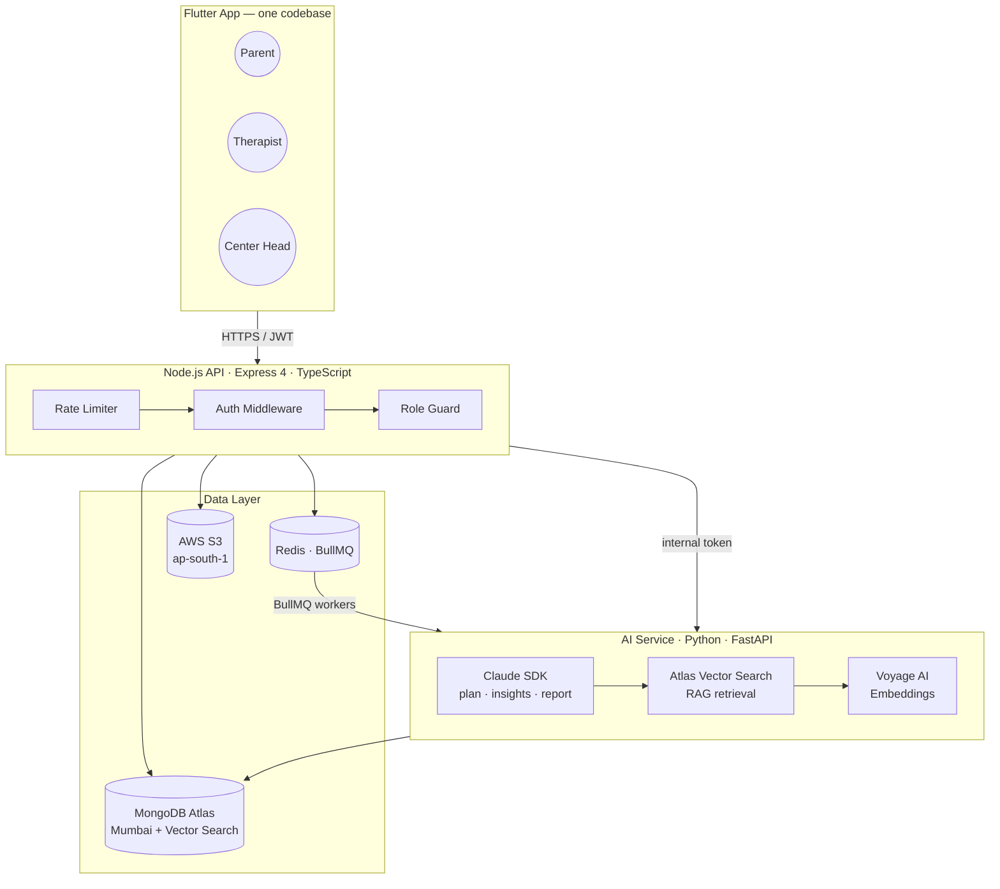
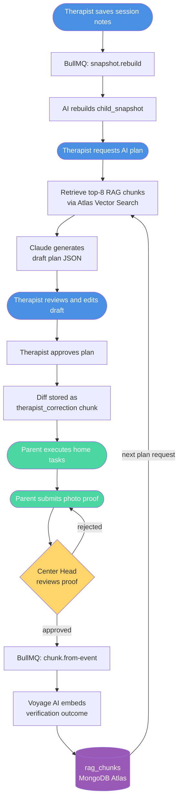
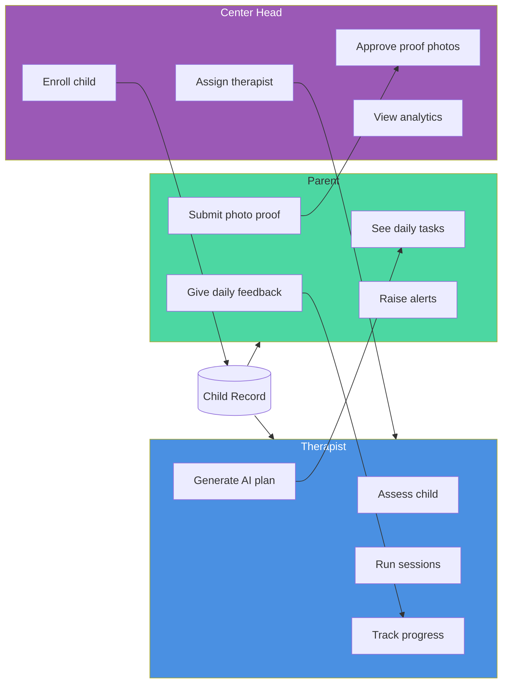
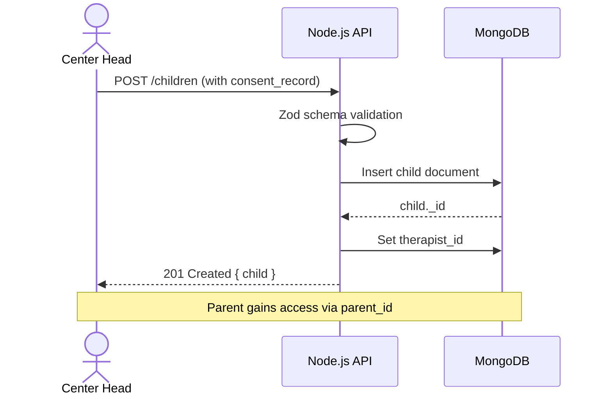
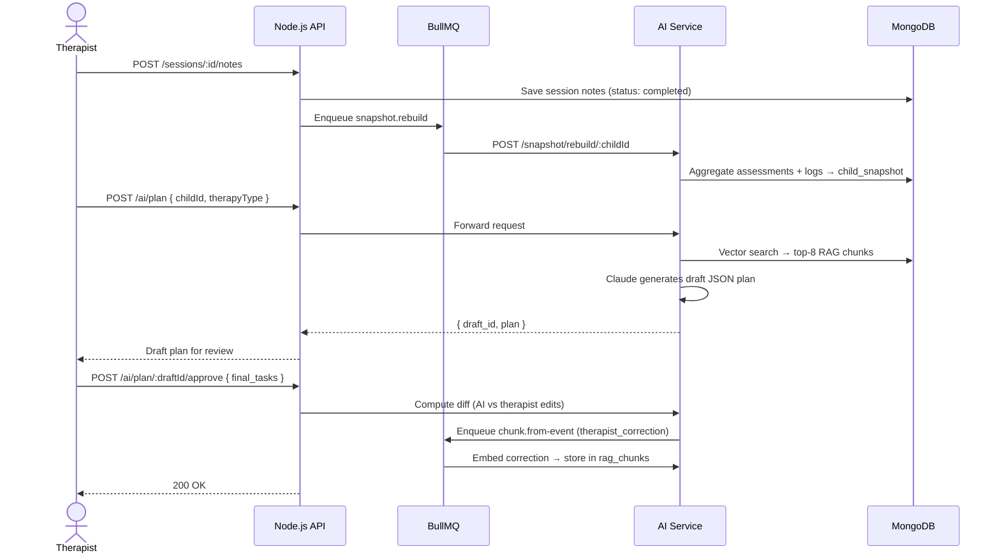
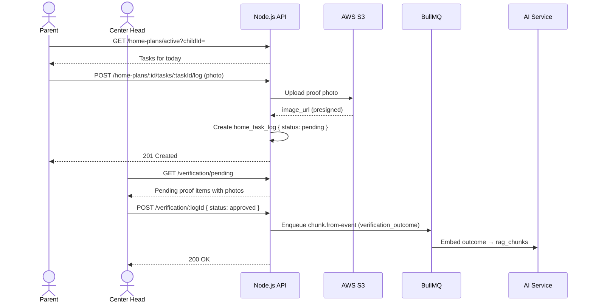

# NaiviSense

**AI-powered therapy coordination platform for children with developmental conditions.**

NaiviSense replaces WhatsApp threads and paper notebooks with a structured, data-driven system where therapists plan, parents execute, and an AI layer learns from every session. Built for therapy centers across India.

---

## Table of Contents

- [Overview](#overview)
- [Architecture](#architecture)
- [Tech Stack](#tech-stack)
- [Repository Structure](#repository-structure)
- [Getting Started](#getting-started)
- [Environment Variables](#environment-variables)
- [Testing](#testing)
- [User Roles](#user-roles)
- [Core Data Flow](#core-data-flow)
- [API Reference](#api-reference)
- [Documentation](#documentation)

---

## Overview

### The Problem

| Problem | Impact |
|---------|--------|
| Session updates live in WhatsApp threads | No continuity of care between therapists |
| Progress is a feeling, not a number | Goals are set without measurable baselines |
| Home practice has zero structure | The #1 predictor of outcomes is ignored |
| When a therapist is unavailable, the next starts from zero | No shared clinical record |

### The Solution

A three-role mobile app where:

- **Therapists** assess children and create AI-assisted home plans
- **Parents** execute daily tasks and submit photo proof
- **Center Heads** approve proof and oversee all children
- **An AI layer** learns from every outcome to improve future plans

---

## Architecture



### How the AI Loop Works



---

## Tech Stack

### Flutter App

| Concern | Package | Version |
|---------|---------|---------|
| State management | flutter_riverpod | ^2.5.1 |
| Navigation | go_router | ^13.2.4 |
| HTTP client | dio | ^5.4.3 |
| Secure token storage | flutter_secure_storage | ^9.0.0 |
| Charts | fl_chart | ^0.68.0 |
| Camera | image_picker | ^1.1.2 |
| Offline cache | hive_flutter | ^1.1.0 |
| Font | Inter (Google Fonts) | — |

### Node.js Backend

| Concern | Tech | Version |
|---------|------|---------|
| Runtime | Node.js | 20 LTS |
| Framework | Express | 4.x |
| Language | TypeScript | 5.4+ |
| ODM | Mongoose | 8.x |
| Auth | jsonwebtoken + bcrypt | 9 + 5 |
| Validation | Zod | 3.x |
| Queue | BullMQ + Redis | 5.x + 7.x |
| Logger | Pino | 8.x |
| Tests | Vitest + Supertest | — |

### AI Service (Python)

| Concern | Tech | Version |
|---------|------|---------|
| Framework | FastAPI | 0.110+ |
| LLM | Anthropic Claude SDK | latest |
| Embeddings | Voyage AI (voyage-3) | latest |
| Vector DB | MongoDB Atlas Vector Search | — |
| Validation | Pydantic | 2.x |

---

## Repository Structure

```
naivisense_final/
│
├── README.md                   # You are here
├── CLAUDE.md                   # Claude Code agent instructions
├── .gitignore
│
├── backend/                    # Node.js API (Express + TypeScript)
│   ├── src/
│   │   ├── index.ts            # Entry point
│   │   ├── app.ts              # Express app + middleware wiring
│   │   ├── config/             # env.ts · db.ts · redis.ts · s3.ts
│   │   ├── middleware/         # auth.ts · role.ts · error.ts · rate-limit.ts
│   │   ├── models/             # Mongoose schemas (user, child, session, …)
│   │   ├── modules/            # Feature modules (auth, children, sessions, …)
│   │   │   ├── auth/           # register · login · refresh · logout
│   │   │   ├── children/       # CRUD + role-scoped listing
│   │   │   ├── sessions/       # create · notes · upcoming
│   │   │   ├── home-plans/     # create · active plan · task log
│   │   │   ├── diet-plans/     # meal plans
│   │   │   ├── verification/   # center head approval queue
│   │   │   ├── alerts/         # parent alerts
│   │   │   ├── reports/        # progress + monthly reports
│   │   │   └── ai/             # thin wrapper → AI service
│   │   ├── jobs/               # BullMQ workers (snapshot · chunk · report)
│   │   └── utils/              # logger.ts · http.ts
│   ├── tests/                  # Vitest integration tests
│   ├── .env.example
│   ├── package.json
│   └── tsconfig.json
│
├── naivisense/                 # Flutter mobile app
│   └── lib/
│       ├── main.dart
│       ├── core/
│       │   ├── constants/      # AppConstants (base URL, storage keys)
│       │   └── theme/          # AppColors · AppTheme
│       ├── routing/            # GoRouter with auth guard + role redirect
│       ├── data/
│       │   ├── services/       # ApiService (Dio) · StorageService
│       │   ├── repositories/   # auth · child · session · home_plan · …
│       │   └── mock/           # mock_repository.dart (tests only)
│       ├── shared/
│       │   ├── models/         # user · child · session · home_plan
│       │   └── widgets/        # AppButton · AppCard · StatTile · state_widgets
│       └── features/
│           ├── auth/           # SplashScreen · RoleLoginScreen · AuthProvider
│           ├── therapist/      # Home · ChildProfile · SessionNotes · AIPlanEditor
│           ├── parent/         # Home · TodayTimeline · Camera · Feedback · Alerts
│           ├── center_head/    # Home · EnrollmentWizard · VerificationPanel
│           └── reports/        # WeeklyReport · ProgressChart
│
├── docs/                       # Detailed reference documentation
│   ├── architecture.md         # System design · DB schemas · security model
│   ├── frontend.md             # Flutter implementation guide + code samples
│   ├── backend.md              # Node.js implementation guide + code samples
│   ├── ai-integration.md       # AI service · RAG pipeline · prompts · jobs
│   └── tracker.md              # Phase-by-phase development tracker
│
└── tasks/
    ├── todo.md                 # Current task checklist
    └── lessons.md              # Session learnings for Claude Code
```

---

## Getting Started

### Prerequisites

| Tool | Version | Install |
|------|---------|---------|
| Node.js | 20 LTS | [nodejs.org](https://nodejs.org) |
| Flutter | 3.19+ | [flutter.dev](https://flutter.dev) |
| Python | 3.11+ | [python.org](https://python.org) |
| Docker | any | [docker.com](https://docker.com) |

### 1. Backend (Node.js API)

```bash
cd backend

# Install dependencies
npm install

# Set up environment (see Environment Variables section below)
cp .env.example .env
# Edit .env: fill MONGO_URL, JWT secrets, etc.

# Start MongoDB + Redis via Docker
docker compose up -d

# Run development server
npm run dev
# Server starts at http://localhost:8000
# Health check: http://localhost:8000/health
```

### 2. Flutter App

```bash
cd naivisense

# Install Flutter dependencies
flutter pub get

# Run on a connected device or emulator
flutter run

# For Android emulator, the API base URL is already set to:
# http://10.0.2.2:8000/api/v1
# For physical device, update AppConstants.baseUrl to your machine's IP
```

### 3. AI Service (Python FastAPI)

```bash
cd backend/ai-service

# Create and activate virtual environment
python -m venv .venv && source .venv/bin/activate

# Install dependencies
pip install -e .

# Set up environment
cp .env.example .env
# Edit .env: fill ANTHROPIC_API_KEY, VOYAGE_API_KEY, MONGO_URL

# Run AI service
uvicorn app.main:app --reload --port 8001
# Service starts at http://localhost:8001
```

### Running the Full Stack

```bash
# Terminal 1: Infrastructure
docker compose up -d

# Terminal 2: Backend API
cd backend && npm run dev

# Terminal 3: AI Service
cd backend/ai-service && uvicorn app.main:app --reload --port 8001

# Terminal 4: Flutter
cd naivisense && flutter run
```

---

## Environment Variables

### Backend (`backend/.env`)

```env
NODE_ENV=development
PORT=8000

# Database (MongoDB Atlas or local)
MONGO_URL=mongodb+srv://<user>:<password>@cluster0.xxxxx.mongodb.net/naivisense

# Redis (local Docker or Elasticache)
REDIS_URL=redis://localhost:6379

# JWT — generate with: node -e "console.log(require('crypto').randomBytes(32).toString('hex'))"
JWT_ACCESS_SECRET=<32-char hex>
JWT_REFRESH_SECRET=<32-char hex>
ACCESS_TOKEN_EXPIRES=15m
REFRESH_TOKEN_EXPIRES=7d

# AWS S3 (for photo proof uploads)
S3_BUCKET=naivisense-dev
S3_REGION=ap-south-1
AWS_ACCESS_KEY_ID=
AWS_SECRET_ACCESS_KEY=

# Internal AI service communication
AI_SERVICE_URL=http://localhost:8001
AI_SERVICE_TOKEN=<shared secret>

ALLOWED_ORIGIN=https://app.naivisense.com
```

### AI Service (`backend/ai-service/.env`)

```env
ANTHROPIC_API_KEY=<anthropic-api-key>
VOYAGE_API_KEY=<voyage-api-key>
MONGO_URL=mongodb+srv://<user>:<password>@cluster0.xxxxx.mongodb.net/naivisense
AI_SERVICE_TOKEN=<same shared secret as backend>
PORT=8001
```

---

## Testing

### Backend

```bash
cd backend

# Run all tests (Vitest + Supertest + in-memory MongoDB)
npm test

# Type check only
npx tsc --noEmit

# Both (required before merge)
npm test && npx tsc --noEmit
```

### Flutter

```bash
cd naivisense

# Static analysis (zero warnings required)
flutter analyze

# Unit + widget tests
flutter test
```

---

## User Roles



| Role | Primary Responsibility | Key Screens |
|------|----------------------|-------------|
| **Center Head** | Enroll children, assign therapists, approve proof photos, analytics | Enrollment wizard · Verification panel · Dashboard |
| **Therapist** | Assess child, create AI-assisted plans, run sessions, track progress | AI plan editor · Session notes · Progress charts |
| **Parent** | Execute daily tasks, submit photo proof, give daily feedback | Today timeline · Camera screen · Feedback form |

Role is set at registration and enforced at both the API (JWT payload) and router (Flutter) layers. A token with `role: parent` cannot call center-head endpoints — the backend rejects it with `403 FORBIDDEN`.

---

## Core Data Flow

### 1. Child Enrollment



### 2. Session Notes + AI Plan



### 3. Home Practice + Proof Verification



---

## API Reference

All endpoints are prefixed with `/api/v1`. Full schemas in [`docs/architecture.md`](docs/architecture.md).

| Method | Path | Role | Description |
|--------|------|------|-------------|
| POST | `/auth/register` | — | Register a new user |
| POST | `/auth/login` | — | Login, receive JWT pair |
| POST | `/auth/refresh` | — | Refresh access token |
| GET | `/users/me` | Any | Get current user |
| POST | `/children` | center_head | Enroll a child |
| GET | `/children` | Any | List children (role-scoped) |
| GET | `/children/:id` | Any | Get child (ownership check) |
| POST | `/sessions` | therapist | Schedule a session |
| POST | `/sessions/:id/notes` | therapist | Submit session notes |
| GET | `/sessions/upcoming` | therapist | Upcoming sessions |
| POST | `/home-plans` | therapist | Create home plan |
| GET | `/home-plans/active` | Any | Active plan for child |
| POST | `/home-plans/:id/tasks/:taskId/log` | parent | Submit proof photo |
| GET | `/verification/pending` | center_head | Pending proof queue |
| POST | `/verification/:logId` | center_head | Approve or reject proof |
| POST | `/alerts` | parent | Raise a concern |
| GET | `/reports/progress` | Any | Progress chart data |
| POST | `/ai/plan` | therapist | Generate AI plan draft |
| POST | `/ai/plan/:draftId/approve` | therapist | Approve edited plan |

### Error Response Format

Every error follows this shape. Flutter pattern-matches on `code`.

```json
{
  "error": {
    "code": "INVALID_INPUT",
    "message": "Validation failed",
    "details": { "phone": ["Invalid phone number"] },
    "retryable": false
  }
}
```

| Code | HTTP | Meaning |
|------|------|---------|
| `INVALID_INPUT` | 400 | Zod validation failure |
| `UNAUTHORIZED` | 401 | Bad or expired token |
| `FORBIDDEN` | 403 | Correct token, wrong role |
| `NOT_FOUND` | 404 | Entity does not exist |
| `CONFLICT` | 409 | Duplicate (phone, etc.) |
| `RATE_LIMITED` | 429 | Too many requests |
| `SERVER_ERROR` | 500 | Unhandled exception |

---

## Documentation

Detailed reference docs with full code samples live in `docs/`:

| File | Contents |
|------|----------|
| [`docs/architecture.md`](docs/architecture.md) | System design, all DB schemas, security model, deployment topology, revenue model |
| [`docs/frontend.md`](docs/frontend.md) | Complete Flutter implementation guide — all models, providers, repositories, screens, and UX rules |
| [`docs/backend.md`](docs/backend.md) | Complete Node.js implementation guide — all models, modules, middleware, jobs, and tests |
| [`docs/ai-integration.md`](docs/ai-integration.md) | AI service (Python FastAPI), RAG pipeline, Claude prompts, BullMQ workers, Atlas Vector Search setup |
| [`docs/tracker.md`](docs/tracker.md) | Phase-by-phase development tracker with task IDs, estimates, and the critical path to MVP |

---

## Security Notes

- Tokens stored in `FlutterSecureStorage` only — never `SharedPreferences`
- JWT access tokens expire in 15 minutes; refresh tokens in 7 days
- All S3 buckets are private; files are served via presigned URLs (15-min expiry)
- Bcrypt cost ≥ 12 rounds
- Every AI call is logged in `ai_calls` collection for audit (cost, tokens, latency)
- Child data cannot be created without `consent_record`
- Rate limiting: 100 req/min general, 10 login attempts/15min per phone

---

## Build Status

| Check | Command | Must pass before merge |
|-------|---------|----------------------|
| Backend tests | `npm test` (in `backend/`) | Yes |
| TypeScript | `npx tsc --noEmit` (in `backend/`) | Yes |
| Flutter analysis | `flutter analyze` (in `naivisense/`) | Yes |
| Flutter tests | `flutter test` (in `naivisense/`) | Yes |
